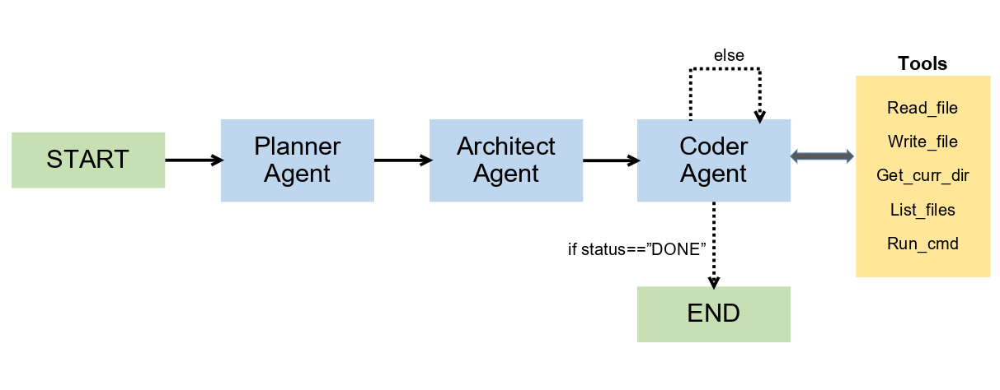

# TapCode 🚀

An Agentic AI project 🤖 that can build code 💻 by just typing the prompt ✍️ and **Tap** Enter ↩  to generate **Code**.

In simple terms, its similar to Loveable, Bolt, etc. 

**Tech Stack Used : ⚙️**

1. Python 🐍

2. LangGraph

3. Groq

4. StateGraph

5. ReactAgent ⚛️

6. Pydantic

7. UV 

8. LangChain Tools ⛓️

## Flow Diagram 🔁

## States

States are Simple dictionaries used by nodes to store information.

All states inherit from pydantic BaseModel.

**File**

| key     | val type | val                                                                            |
|:-------:|:--------:|:------------------------------------------------------------------------------:|
| path    | str      | The path to the file to be created or modified                                 |
| purpose | str      | The purpose fo the file, e.g. 'main app logic', 'data processing module', etc. |

**Plan**

| key         | val type   | val                                                                                                     |
|:-----------:|:----------:|:-------------------------------------------------------------------------------------------------------:|
| name        | str        | The name of app that is to be built                                                                     |
| description | str        | A online description of the app to be built,  eg 'A web application for managing personal finances' |
| techstack   | str        | The tech stack to be used for the app, e.g. python, javascript, react, flask, etc.                      |
| features    | list[str]  | A list of features that the app should have, e.g. 'user authentication', 'data visualization', etc.     |
| files       | list[File] | A list of files to be created, each with a 'path' and 'purpose                                          |

**Implementation Task**

| key              | val type | val                                                                                                                                          |
|:----------------:|:--------:|:--------------------------------------------------------------------------------------------------------------------------------------------:|
| filepath         | str      | The path to the file to be modified                                                                                                          |
| task_description | str      | A detailed description of the task to be performed on the file,  e.g. 'add user authentication', 'implement data processing logic', etc. |

**Task Plan**

| key                  | val type                    | val                                               |
|:--------------------:|:---------------------------:|:-------------------------------------------------:|
| implementation_steps | list [ ImplementationTask ] | A list of steps to be taken to implement the task |
| model_config         | -                           | ConfigDict(extra="allow")                         |

NOTE : setting ConfigDict with extra allowed help TaskPlan to add any other key and val to the dictionary.

**Coder State**

| key              | val type         | val                                                                      |
|:----------------:|:----------------:|:------------------------------------------------------------------------:|
| task_plan        | TaskPlan         | The plan for the task to be implemented.                                 |
| cur_step_i       | int              | The index of the current step in the implementation steps. Default: 0    |
| cur_file_content | Optional [ str ] | The content of the file currently being edited or created. Default: None |

## Output Sample

**Here is how the intermediate nodes variables of LangGraph look like for building calculator app :**

{

    'coder_state': CoderState(

        task_plan=TaskPlan(

            implementation_steps=[

                ImplementationTask(

                    filepath='index.html', 

                    task_description='Create the base HTML structure for the SimpleCalculator SPA.\n- Define a <!DOCTYPE html> document with <html>, <head>, and <body>.\n- In <head>, include <meta charset="UTF-8">, <meta name="viewport" content="width=device-width, initial-scale=1.0">, a <title>Simple Calculator</title>, and link to styles.css (`<link rel="stylesheet" href="styles.css">`).\n- In <body>, create a main container `
`.\n- Inside the container, add:\n  1. `

` – the display area for current input and results.\n  2. `
` containing button elements for digits 0‑9, operators (+, -, *, /), clear (C), backspace (⌫), decimal point (.), and equals (=). Each button gets:\n     - a `data-action` attribute (e.g., `data-action="add"`, `data-action="digit"`).\n     - a `data-value` attribute for digits and the decimal point.\n     - appropriate class names (`button`, `digit`, `operator`, `control`).\n- Add a `` tag before closing </body>.\n- Ensure semantic accessibility: use `role="button"` and `tabindex="0"` on each button for keyboard navigation.\n- This file provides the static UI that styles.css will style and app.js will attach event listeners to.'),                 ImplementationTask(

                    filepath='styles.css', 

                    task_description='Implement responsive styling for the calculator UI.\n- Define CSS variables for primary colors, button size, font, and spacing.\n- Style the body to center the calculator using flexbox and set a neutral background.\n- Style `.calculator` with a max-width, background color, border-radius, box-shadow, and padding.\n- Style `.display` to have a fixed height, right‑aligned text, large font-size, overflow‑hidden, and a subtle border.\n- Create a `.buttons-grid` using CSS Grid:\n  - `grid-template-columns: repeat(4, 1fr);` for a 4‑column layout.\n  - Gap for spacing.\n- Style `.button` base class: size, font, cursor, border, border-radius, transition.\n- Add specific styles for `.digit`, `.operator`, and `.control` (different background colors).\n- Implement hover/focus states for accessibility.\n- Add media queries (`@media (max-width: 600px)`) to adjust font sizes and button padding for mobile devices.\n- Ensure the CSS file is independent but matches the element IDs/classes defined in index.html, enabling app.js to query DOM elements reliably.'), 

                ImplementationTask(

                    filepath='app.js', 

                    task_description="Develop the core JavaScript logic for the calculator SPA.\n- **Module Scope Variables**:\n  - `const display = document.getElementById('display');`\n  - `let currentInput = '';\n  - `let previousValue = null;`\n  - `let operator = null;`\n- **Helper Functions**:\n  1. `updateDisplay()` – sets `display.textContent` to `currentInput || '0'`.\n  2. `clearAll()` – resets `currentInput`, `previousValue`, and `operator`.\n  3. `backspace()` – removes the last character from `currentInput`.\n  4. `appendDigit(digit)` – concatenates digit (or '.') to `currentInput` ensuring only one decimal point.\n  5. `setOperator(op)` – if `previousValue` is null, store `parseFloat(currentInput)` as `previousValue`; otherwise compute pending operation. Then set `operator = op` and clear `currentInput`.\n  6. `calculate()` – perform arithmetic based on `operator`, `previousValue`, and `parseFloat(currentInput)`. Handle division by zero by displaying `'Error'`.\n  7. `handleButtonClick(event)` – delegate based on `data-action` attribute of clicked button (digit, operator, clear, backspace, equals, decimal).\n  8. `handleKeyboard(event)` – map key presses (`0-9`, `.`, `Enter`/`=`, `Escape` for clear, `Backspace`, `+ - * /`) to the same helper functions.\n- **Event Listeners**:\n  - Attach `click` listener to `.buttons-grid` container that calls `handleButtonClick`.\n  - Attach `keydown` listener on `document` that calls `handleKeyboard`.\n- **Export/Expose** (if using modules, but keep simple): wrap code in an IIFE to avoid polluting global scope.\n- **Integration Details**:\n  - The script expects the DOM elements defined in index.html (`#display`, buttons with `data-action` and `data-value`).\n  - All UI updates flow through `updateDisplay()` ensuring consistent rendering.\n  - Error handling: on division by zero set `currentInput = 'Error'` and reset state on next clear.\n  - The functions are defined in order of dependency: helpers first, then event handlers, then listener registration.\n- This file completes the interactive behavior, consuming the markup from index.html and the styling from styles.css."),

                ImplementationTask(

                    filepath='README.md', 

                    task_description='Write comprehensive project documentation.\n- Title and brief description of SimpleCalculator.\n- **Tech Stack** section listing HTML, CSS, JavaScript.\n- **Features** bullet list mirroring the project plan.\n- **Installation / Setup**:\n  1. Clone the repository.\n  2. Open `index.html` in a browser (no server required).\n- **Usage Guide**:\n  - Explain button layout, keyboard shortcuts, clear/backspace behavior, and error handling.\n- **Responsive Design** note describing mobile layout.\n- **Development** notes:\n  - File structure (`index.html`, `styles.css`, `app.js`).\n  - How to extend (e.g., adding scientific functions).\n- **License** placeholder.\n- Ensure the README references the exact file names so future contributors know the integration points.\n- This documentation does not affect runtime but provides context for users and developers.')

        ],

        plan=Plan(

            name='SimpleCalculator', 

            description='A lightweight web application that provides a simple calculator interface for performing basic arithmetic operations (addition, subtraction, multiplication, division) with a clean, responsive UI.', 

            techstack='HTML, CSS, JavaScript', 

            features=[

                'User-friendly calculator UI with buttons for digits 0-9 and operations (+, -, *, /)', 

                'Display area to show current input and results', 

                'Support for clear (C) and backspace (⌫) functionalities', 

                'Keyboard input handling for numbers and operators', 

                'Responsive design for desktop and mobile devices', 

                'Basic error handling (e.g., division by zero)', 

                'Single-page application with no backend dependencies'

            ], 

            files=[

                File(

                    path='index.html', 

                    purpose='HTML markup for the calculator layout and UI components'

                ), 

                File(

                    path='styles.css', 

                    purpose='Styling for the calculator, ensuring a clean look and responsive behavior'

                ), 

                File(

                    path='app.js', 

                    purpose='Core JavaScript logic handling button clicks, keyboard input, calculations, and UI updates'

                ), 

                File(

                    path='README.md', 

                    purpose='Project overview, setup instructions, and usage guide'

                )

            ])

        ), 

        cur_step_i=4, 

        cur_file_content=None

    ), 

    'status': 'DONE'

}
